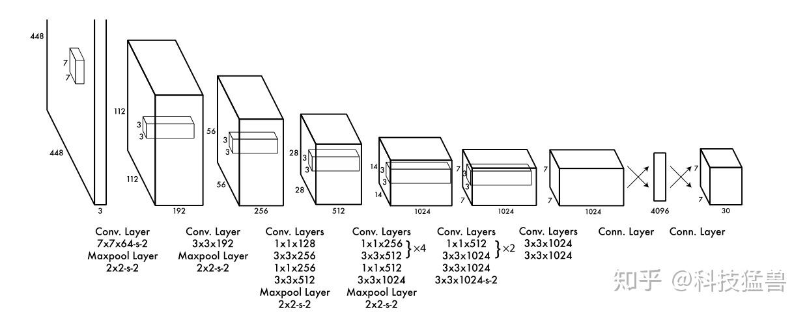
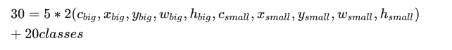
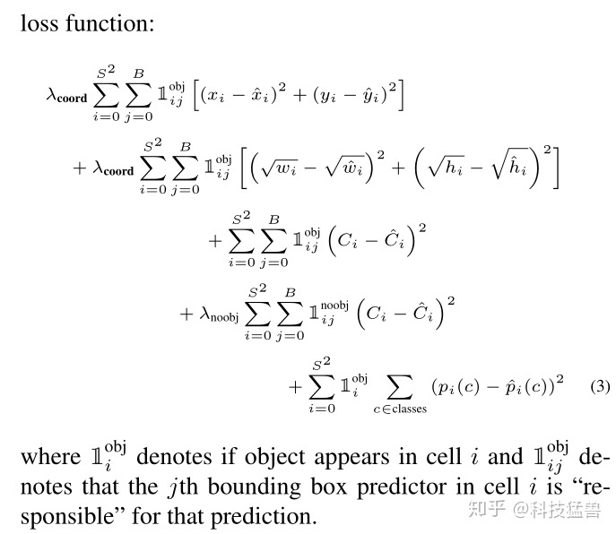
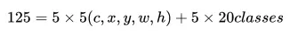
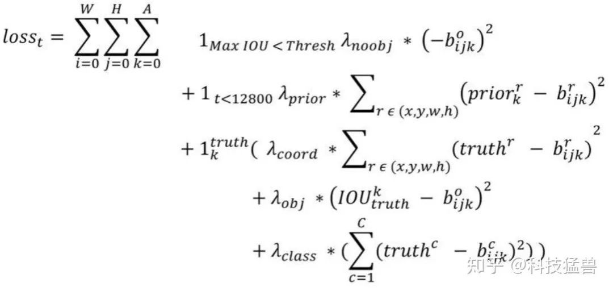
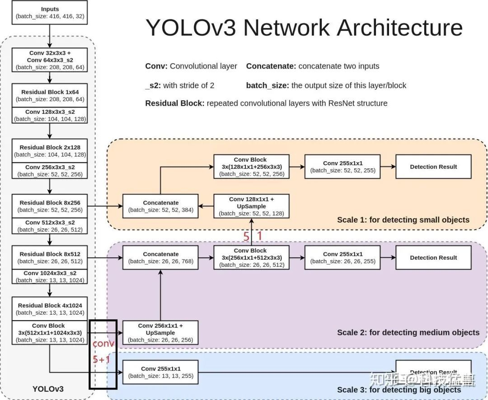
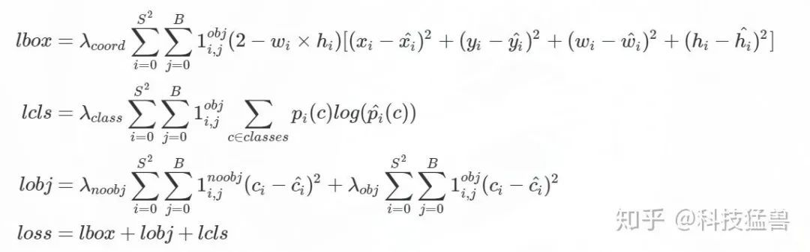
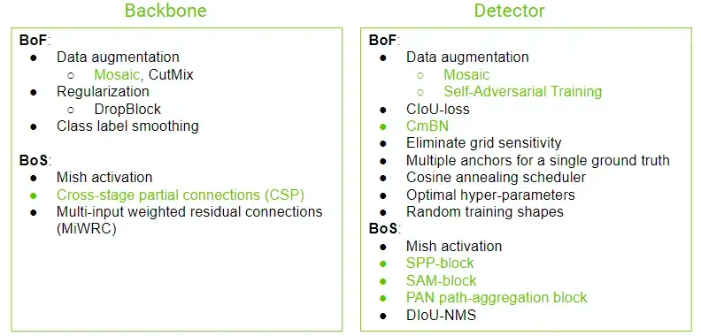
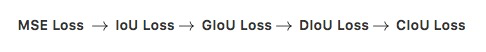
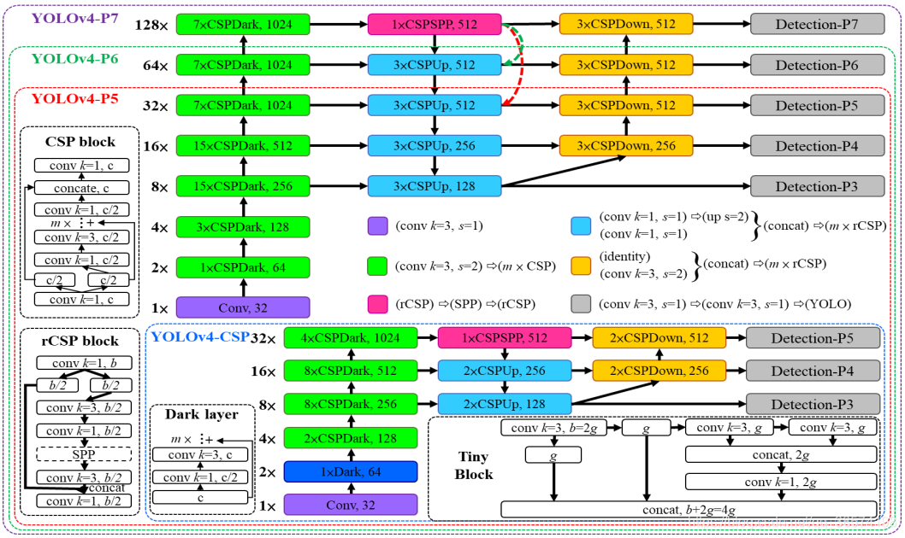

# YOLO v1 #

## Main Idea ##

The input image is divided into an S×S grid (S=7). If the center of an object falls into a grid cell, that grid cell is responsible for detecting that object.

Each grid cell predicts B bounding boxes (B=2) and confidence scores for those boxes. These confidence scores reflect how confident the model is that the box contains an object, i.e. any objects in the box, P(Objects).

Each bounding box consists of 5 predictions: x, y, w, h, and confidence.

    The (x, y) coordinates represent the center of the box relative to the bounds of the grid cell.
    The width w and height h are predicted relative to the whole image.
    The confidence represents the Intersection Over Union (IOU) between the predicted box and any ground truth box.

Each grid cell also predicts conditional class probabilities, P(Class|Object). (Total number of classes=20)

## Architecture ##

## Head ##

## Loss Function ##

# YOLO v2 #

## Main Idea ##

Two problems in Yolo v1
1. The bounding boxes predicted are not accurate.

2. Failed to find many objects which result in low recall rate.

        Using the famous prior anchors to solve these two problems just like RCNN. Also change 7*7 feature maps to 13*13 feature maps to improve recall rate.

## Architecture ##

Not like Yolov1 using GoogleLeNet, Yolov2 use darknet19 instead.

## Head ##

## Loss Function ##

# YOLO v3 #

## Main Idea ##

1. Use the famous multi-scale feature maps to detect objects in different sizes.
2. Use K-means algorithm on the bounding boxes in the dataset to set the prior anchor sizes.
3. Use darknet53 as backbone.
## Architecture ##

## Head ##

Use 3 anchor boxes for each anchor, so the head will be:
            
            
            [13,13,3*(4+1+80)]
            
            
            [26,26,3*(4+1+80)]
            
            
            [52,52,3*(4+1+80)]

## Loss Function ##

# YOLO v7 #

more details at https://medium.com/aiguys/yolo-v4-explained-in-full-detail-5200b77aa825

## Main Idea ##

1. Use multi-anchors for single ground truth. Yolo v3 set a positive anchor for each ground truth while Yolo v4 set any anchors that meet IOU(AnchorBox, GroundTruthBox) > threshold as positive.
2. Eliminate_grid sensitivity.
3. Use CIoU loss
## Architecture ##

CSPDarkNet53 (Head) => SSP + PANet (Neck)=> YOLOv3 (head)

## Head ##

Similar to Yolo v3

## YOLOv4 BoF and BoS selection ## 

## Loss Function ##

# YOLO v4 #

more details at https://medium.com/aiguys/yolo-v4-explained-in-full-detail-5200b77aa825

## Main Idea ##

1. Use multi-anchors for single ground truth. Yolo v3 set a positive anchor for each ground truth while Yolo v4 set any anchors that meet IOU(AnchorBox, GroundTruthBox) > threshold as positive.
2. Eliminate_grid sensitivity.
3. Use CIoU loss
## Architecture ##

CSPDarkNet53 (Head) => SSP + PANet (Neck)=> YOLOv3 (head)

## Head ##

Similar to Yolo v3

## YOLOv4 BoF and BoS selection ## 

## Loss Function ##

# Scaled YOLO v4 #

## Architecture ##

# YOLO v7 #
more details at https://medium.com/aiguys/yolov7-making-yolo-great-again-7b1ec1f6a2a0